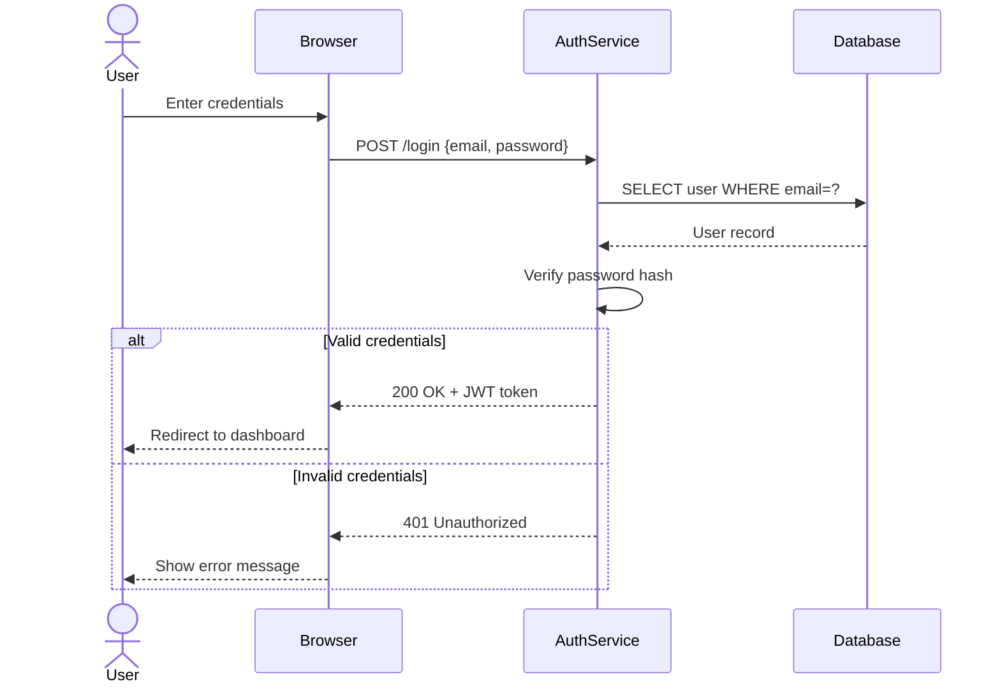

# Worked Examples

Three examples — one per routing tier — showing how delivery and XML rules differ.

---

## Tier 1 — Mermaid: Login flow sequence diagram

**Prompt:** "Sequence diagram of a login flow" *(no colour requirement stated)*
**Route:** Sequence diagram, structure-only → MCP available → `open_drawio_mermaid`

Tier 1 is for structure, not colour. draw.io's Mermaid renderer ignores all colour directives (`themeVariables`, `classDef`). If colour coding is needed, route to Tier 2 instead.



**Delivery:** Call `open_drawio_mermaid` with the Mermaid string above. No file written.
**Tell Vicky:** "Diagram open in draw.io — login flow showing happy path auth and 401 branch."

---

## Tier 2 — MCP XML: Order processing workflow (no coordinates)

**Prompt:** "Swimlane workflow for order processing"
**Route:** Swimlane + fan-out → MCP available → `open_drawio_xml`

Key rules applied: explicit x/y/width/height on containers and nodes (draw.io does not auto-size containers), no `Array as="points"` waypoints on edges, no exitX/exitY overrides on edges.

```xml
<mxfile host="app.diagrams.net">
  <diagram name="Page-1" id="diagram-1">
    <mxGraphModel>
      <root>
        <mxCell id="0"/>
        <mxCell id="1" parent="0"/>

        <!-- Customer lane -->
        <mxCell id="lane-customer" value="Customer" style="swimlane;startSize=30;fillColor=#dae8fc;strokeColor=#6c8ebf;whiteSpace=wrap;html=1;" vertex="1" parent="1">
          <mxGeometry x="40" y="40" width="1000" height="100" as="geometry"/>
        </mxCell>
        <mxCell id="place-order" value="Place Order" style="rounded=1;whiteSpace=wrap;html=1;" vertex="1" parent="lane-customer">
          <mxGeometry x="40" y="30" width="140" height="50" as="geometry"/>
        </mxCell>
        <mxCell id="receive-confirmation" value="Receive Confirmation" style="rounded=1;whiteSpace=wrap;html=1;" vertex="1" parent="lane-customer">
          <mxGeometry x="280" y="30" width="160" height="50" as="geometry"/>
        </mxCell>

        <!-- Order Service lane -->
        <mxCell id="lane-order" value="Order Service" style="swimlane;startSize=30;fillColor=#d5e8d4;strokeColor=#82b366;whiteSpace=wrap;html=1;" vertex="1" parent="1">
          <mxGeometry x="40" y="160" width="1000" height="100" as="geometry"/>
        </mxCell>
        <mxCell id="validate-order" value="Validate Order" style="rounded=1;whiteSpace=wrap;html=1;" vertex="1" parent="lane-order">
          <mxGeometry x="40" y="30" width="140" height="50" as="geometry"/>
        </mxCell>
        <mxCell id="create-order" value="Create Order Record" style="rounded=1;whiteSpace=wrap;html=1;" vertex="1" parent="lane-order">
          <mxGeometry x="280" y="30" width="160" height="50" as="geometry"/>
        </mxCell>

        <!-- Payment lane -->
        <mxCell id="lane-payment" value="Payment Service" style="swimlane;startSize=30;fillColor=#fff2cc;strokeColor=#d6b656;whiteSpace=wrap;html=1;" vertex="1" parent="1">
          <mxGeometry x="40" y="280" width="1000" height="100" as="geometry"/>
        </mxCell>
        <mxCell id="charge-card" value="Charge Card" style="rounded=1;whiteSpace=wrap;html=1;" vertex="1" parent="lane-payment">
          <mxGeometry x="280" y="30" width="140" height="50" as="geometry"/>
        </mxCell>

        <!-- Fulfillment lane -->
        <mxCell id="lane-fulfil" value="Fulfillment" style="swimlane;startSize=30;fillColor=#f8cecc;strokeColor=#b85450;whiteSpace=wrap;html=1;" vertex="1" parent="1">
          <mxGeometry x="40" y="400" width="1000" height="100" as="geometry"/>
        </mxCell>
        <mxCell id="pick-pack" value="Pick &amp; Pack" style="rounded=1;whiteSpace=wrap;html=1;" vertex="1" parent="lane-fulfil">
          <mxGeometry x="280" y="30" width="140" height="50" as="geometry"/>
        </mxCell>
        <mxCell id="ship" value="Ship" style="rounded=1;whiteSpace=wrap;html=1;" vertex="1" parent="lane-fulfil">
          <mxGeometry x="500" y="30" width="140" height="50" as="geometry"/>
        </mxCell>

        <!-- Edges — no waypoints, no exitX/entryX overrides -->
        <mxCell id="e1" edge="1" source="place-order" target="validate-order" parent="1"><mxGeometry relative="1" as="geometry"/></mxCell>
        <mxCell id="e2" edge="1" source="validate-order" target="create-order" parent="1"><mxGeometry relative="1" as="geometry"/></mxCell>
        <mxCell id="e3" edge="1" source="create-order" target="charge-card" parent="1"><mxGeometry relative="1" as="geometry"/></mxCell>
        <mxCell id="e4" edge="1" source="charge-card" target="pick-pack" parent="1"><mxGeometry relative="1" as="geometry"/></mxCell>
        <mxCell id="e5" edge="1" source="pick-pack" target="ship" parent="1"><mxGeometry relative="1" as="geometry"/></mxCell>
        <mxCell id="e6" edge="1" source="create-order" target="receive-confirmation" parent="1"><mxGeometry relative="1" as="geometry"/></mxCell>
      </root>
    </mxGraphModel>
  </diagram>
</mxfile>
```

**Delivery:** Call `open_drawio_xml` with the XML above. No file written.
**Tell Vicky:** "Diagram open in draw.io — order processing across Customer, Order Service, Payment, and Fulfillment lanes."

---

## Tier 3 — File write: Order processing workflow (full coordinates)

**Prompt:** "Swimlane workflow for order processing -no-mcp"
**Route:** `-no-mcp` flag present → Tier 3 file write; REFERENCE.md rules apply in full.

Key rules applied: explicit x/y on every `mxGeometry`, corridor waypoints on all cross-lane edges, exitX/entryX overrides to keep edges out of shape centres.

```xml
<mxfile host="app.diagrams.net">
  <diagram name="Page-1" id="diagram-1">
    <mxGraphModel grid="0" gridSize="10" pageWidth="1169" pageHeight="827">
      <root>
        <mxCell id="0"/>
        <mxCell id="1" parent="0"/>

        <!-- Customer lane: y=40, h=120 -->
        <mxCell id="lane-customer" value="Customer" style="swimlane;startSize=30;fillColor=#dae8fc;strokeColor=#6c8ebf;whiteSpace=wrap;html=1;" vertex="1" parent="1">
          <mxGeometry x="40" y="40" width="1080" height="120" as="geometry"/>
        </mxCell>
        <mxCell id="place-order" value="Place Order" style="rounded=1;whiteSpace=wrap;html=1;" vertex="1" parent="lane-customer">
          <mxGeometry x="40" y="45" width="140" height="50" as="geometry"/>
        </mxCell>
        <mxCell id="receive-confirmation" value="Receive Confirmation" style="rounded=1;whiteSpace=wrap;html=1;" vertex="1" parent="lane-customer">
          <mxGeometry x="280" y="45" width="160" height="50" as="geometry"/>
        </mxCell>

        <!-- Corridor: y=160, h=20 -->

        <!-- Order Service lane: y=180, h=120 -->
        <mxCell id="lane-order" value="Order Service" style="swimlane;startSize=30;fillColor=#d5e8d4;strokeColor=#82b366;whiteSpace=wrap;html=1;" vertex="1" parent="1">
          <mxGeometry x="40" y="180" width="1080" height="120" as="geometry"/>
        </mxCell>
        <mxCell id="validate-order" value="Validate Order" style="rounded=1;whiteSpace=wrap;html=1;" vertex="1" parent="lane-order">
          <mxGeometry x="40" y="45" width="140" height="50" as="geometry"/>
        </mxCell>
        <mxCell id="create-order" value="Create Order Record" style="rounded=1;whiteSpace=wrap;html=1;" vertex="1" parent="lane-order">
          <mxGeometry x="280" y="45" width="160" height="50" as="geometry"/>
        </mxCell>

        <!-- Corridor: y=300, h=20 -->

        <!-- Payment lane: y=320, h=120 -->
        <mxCell id="lane-payment" value="Payment Service" style="swimlane;startSize=30;fillColor=#fff2cc;strokeColor=#d6b656;whiteSpace=wrap;html=1;" vertex="1" parent="1">
          <mxGeometry x="40" y="320" width="1080" height="120" as="geometry"/>
        </mxCell>
        <mxCell id="charge-card" value="Charge Card" style="rounded=1;whiteSpace=wrap;html=1;" vertex="1" parent="lane-payment">
          <mxGeometry x="280" y="45" width="140" height="50" as="geometry"/>
        </mxCell>

        <!-- Corridor: y=440, h=20 -->

        <!-- Fulfillment lane: y=460, h=120 -->
        <mxCell id="lane-fulfil" value="Fulfillment" style="swimlane;startSize=30;fillColor=#f8cecc;strokeColor=#b85450;whiteSpace=wrap;html=1;" vertex="1" parent="1">
          <mxGeometry x="40" y="460" width="1080" height="120" as="geometry"/>
        </mxCell>
        <mxCell id="pick-pack" value="Pick &amp; Pack" style="rounded=1;whiteSpace=wrap;html=1;" vertex="1" parent="lane-fulfil">
          <mxGeometry x="280" y="45" width="140" height="50" as="geometry"/>
        </mxCell>
        <mxCell id="ship" value="Ship" style="rounded=1;whiteSpace=wrap;html=1;" vertex="1" parent="lane-fulfil">
          <mxGeometry x="500" y="45" width="140" height="50" as="geometry"/>
        </mxCell>

        <!-- Same-lane edges: no waypoints needed -->
        <mxCell id="e-val-create" edge="1" source="validate-order" target="create-order" parent="lane-order">
          <mxGeometry relative="1" as="geometry"/>
        </mxCell>
        <mxCell id="e-pick-ship" edge="1" source="pick-pack" target="ship" parent="lane-fulfil">
          <mxGeometry relative="1" as="geometry"/>
        </mxCell>

        <!-- Cross-lane edges: corridor waypoints at y=170 (cust→order), y=310 (order→payment), y=450 (payment→fulfil) -->
        <mxCell id="e-place-validate" edge="1" source="place-order" target="validate-order" parent="1"
          exitX="0.5" exitY="1" entryX="0.5" entryY="0">
          <mxGeometry relative="1" as="geometry">
            <Array as="points">
              <mxPoint x="150" y="170"/>
              <mxPoint x="150" y="170"/>
            </Array>
          </mxGeometry>
        </mxCell>
        <mxCell id="e-create-confirm" edge="1" source="create-order" target="receive-confirmation" parent="1"
          exitX="0.5" exitY="0" entryX="0.5" entryY="1">
          <mxGeometry relative="1" as="geometry">
            <Array as="points">
              <mxPoint x="360" y="170"/>
              <mxPoint x="360" y="170"/>
            </Array>
          </mxGeometry>
        </mxCell>
        <mxCell id="e-create-charge" edge="1" source="create-order" target="charge-card" parent="1"
          exitX="0.5" exitY="1" entryX="0.5" entryY="0">
          <mxGeometry relative="1" as="geometry">
            <Array as="points">
              <mxPoint x="360" y="310"/>
              <mxPoint x="360" y="310"/>
            </Array>
          </mxGeometry>
        </mxCell>
        <mxCell id="e-charge-pick" edge="1" source="charge-card" target="pick-pack" parent="1"
          exitX="0.5" exitY="1" entryX="0.5" entryY="0">
          <mxGeometry relative="1" as="geometry">
            <Array as="points">
              <mxPoint x="360" y="450"/>
              <mxPoint x="360" y="450"/>
            </Array>
          </mxGeometry>
        </mxCell>
      </root>
    </mxGraphModel>
  </diagram>
</mxfile>
```

**Delivery:** Write `order-processing.drawio`. Tell Vicky: "`order-processing.drawio` ready — drag onto app.diagrams.net or open in VS Code."
